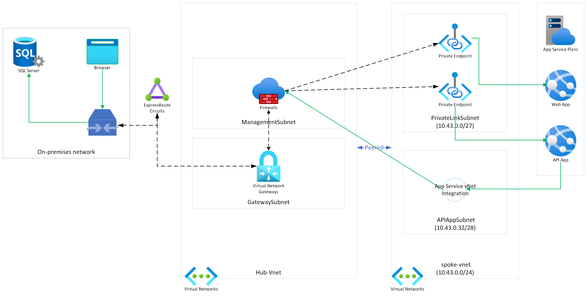

# Azure App Services - Private Network with Azure DevOps VM Agent - Example

This repository contains an example of how to use Azure App Services with a private network and Azure DevOps VM Agent.

This Bicep template deploys the following resources:

- 2 x Virtual Network and Subnets
- 2 x Azure App Service Plan
- 2 x Azure App Service
- 1 x Private DNS Zone
- 2 x Private Endpoints and Private Link
- Virtual Machine for Azrue DevOps Agent
- Bastion Host

[](./media/AppServicePrivateNetworking.png)

## Prerequisites

- Azure subscription

## Setup

1. Create a new Resource Group
2. Run the following command to deploy the ARM template

```bash
RESOURCE_GROUP_NAME=<resource-group-name>

az group create --name $RESOURCE_GROUP_NAME --location <location>

az deployment group create --resource-group RESOURCE_GROUP_NAME --template-file main.bicep
```

## License

See [LICENSE](./LICENSE.md).

## Contributing

This project has adopted the [Microsoft Open Source Code of Conduct](https://opensource.microsoft.com/codeofconduct/). For more information see the [Code of Conduct FAQ](https://opensource.microsoft.com/codeofconduct/faq/) or contact [opencode@microsoft.com](mailto:opencode@microsoft.com) with any additional questions or comments. More details on how to contribute see [contributing guide](./CONTRIBUTING.md).
